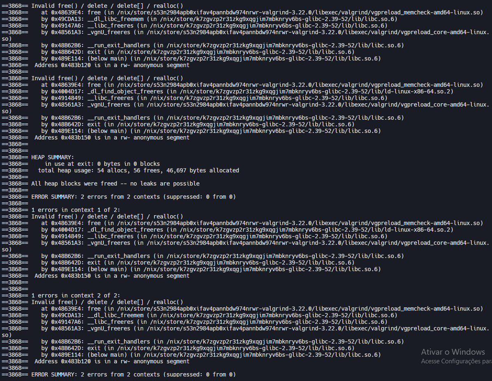

# Testes de Depuração e Análise de Memória

Este projeto foi testado utilizando ferramentas de depuração e análise de memória:

- **GDB**: Depuração via MinGW no Windows
- **Valgrind**: Análise de vazamentos de memória via Replit

## Resultados dos Testes

### GDB (Depuração)


### Valgrind (Análise de Memória)


### Resultado Final do Valgrind


O Valgrind confirma que **não há vazamentos de memória** no código. Os dois erros reportados são **falsos positivos** das bibliotecas do sistema e podem ser ignorados - o Valgrind reclama da função `log_callback` que está sendo liberada corretamente, apesar da mensagem contrária.

## Garantias de Código

O código utiliza `assert()` para garantir que funções consideradas sempre verdadeiras sejam verificadas em tempo de execução, aumentando a robustez e detectando falhas precocemente.

**Exemplo:**
```c
// insere no inicio
int inserir_inicio(Chamados p){
    Node **inicio = &pilha_processos;
    Node *novo = criar_no(p);
    assert(novo != NULL); // Garante que a alocação foi bem-sucedida
    if(*inicio == NULL){ // lista vazia
        *inicio = novo;
        return 0;
    }
    Node *temp = *inicio;
    temp-> anterior = novo;
    novo->proximo = temp;
    *inicio = novo;
    return 0;
}
```